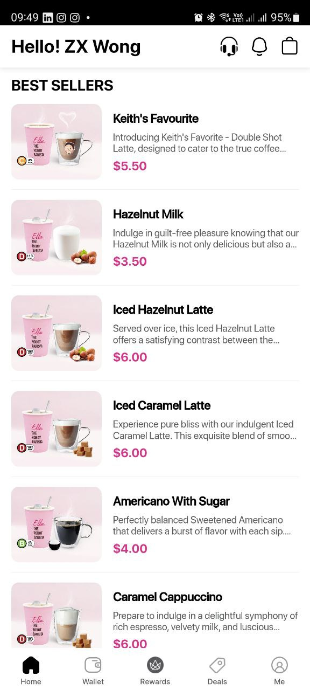

# Q2: UI Task: List of Containers in Flutter App (Dart)

### Question 2
- Create a simple Flutter UI that displays a list of 10 Containers, separated by Dividers.
- Each Container must have an Image and Title, Description, Price
- You are NOT expected to render the UI with any text formatting, just a snippet of code that proofs your understanding of Flutter UI will do.

</br>

**You may refer to this image under ```BEST SELLERS```**



</br>

**Allowed language:** Dart only

**Allowed files:** ```simpleapp/* | simpleapp/lib/main.dart```